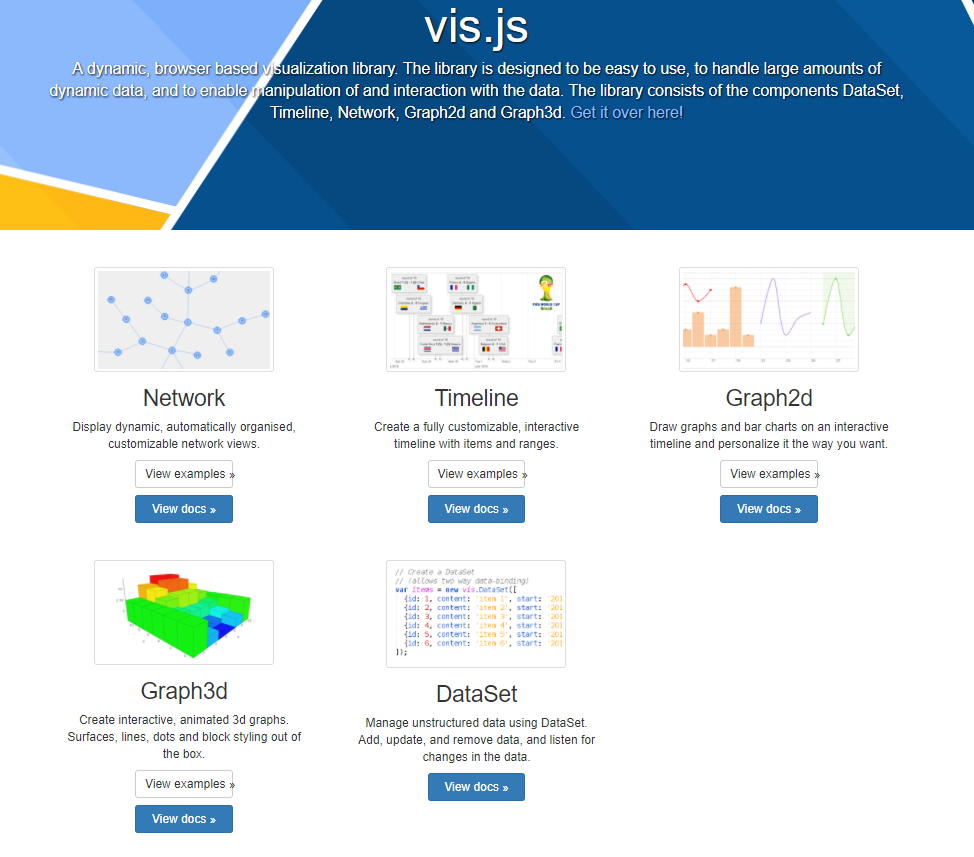

# UI设计


## 绘图库
### [vis.js](http://visjs.org/)

```
组件丰富，包括网络拓扑、时间轴、2D、3D
```
###### DEMO

- [网络拓扑-基本](http://visjs.org/examples/network/nodeStyles/images.html)
- [网络拓扑-标签](http://visjs.org/examples/network/exampleApplications/nodeLegend.html)
- [网络拓扑-Monitor](http://visjs.org/examples/network/data/datasets.html)
- [网路路径](http://visjs.org/examples/network/edgeStyles/arrows.html)
- [More](http://visjs.org/network_examples.html)

###### License
[Apache 2.0](http://www.apache.org/licenses/LICENSE-2.0) and [MIT](http://opensource.org/licenses/MIT)