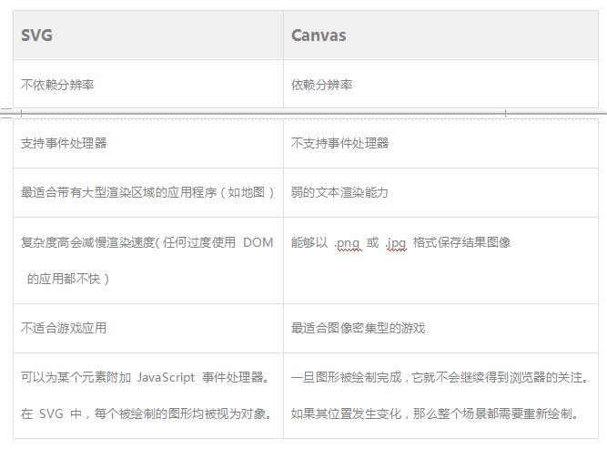

# UI设计


## 绘图库
### 1. [vis.js](http://visjs.org/)

```
组件丰富，包括网络拓扑、时间轴、2D、3D
文档优秀
基于canvas
```
###### DEMO

- [网络拓扑-基本](http://visjs.org/examples/network/nodeStyles/images.html)
- [网络拓扑-标签](http://visjs.org/examples/network/exampleApplications/nodeLegend.html)
- [网络拓扑-Monitor](http://visjs.org/examples/network/data/datasets.html)
- [网路路径](http://visjs.org/examples/network/edgeStyles/arrows.html)
- [More](http://visjs.org/network_examples.html)

###### License
[Apache 2.0](http://www.apache.org/licenses/LICENSE-2.0) and [MIT](http://opensource.org/licenses/MIT)


### 2. [D3.js](https://d3js.org/)
```
组件灵活，自由度大,数以万计Demo
上手难度大于vis.js
基于svg
```
###### DEMO

- [网络拓扑-基本](http://ahmetrasit.com/blosum/)
- [网络拓扑-标签](http://blockbuilder.org/emeeks/39fea1d900964379416b)
- [网络拓扑-Monitor](https://piratepeel.github.io/proximitynetwork.html)
- [网路路径](http://blockbuilder.org/emeeks/040c4eb87d36de3c87d3)
- [More](https://github.com/d3/d3/wiki/Gallery)

###### License
[BSD license](https://opensource.org/licenses/BSD-3-Clause)

### 3. [jTopo](https://d3js.org/)
```
一、完全基于HTML5 Canvas开发，始终站在开发者的角度设计，API平易近人、几乎简单到了极致。
二、不依赖任何其他库、执行仅需一个Canvas，不污染你的页面、Dom结构和代码命名空间。
三、功能异常强大、灵活，可扩展性极强（为扩展而生），包装一下，就是一款很专业的图形化软件。
四、体积小，压缩后仅几十KB。
五、性能十分优异，可流畅地展示大量数据(经过专业优化过甚至可以展示几十万、百万级别的数据)
```
###### DEMO

- [网络拓扑-基本](http://www.jtopo.com/demo/pstn.html)
- [网络拓扑-标签](http://www.jtopo.com/demo/node-label-position.html)
- [网络拓扑-Monitor](http://www.jtopo.com/demo/topo-alarm.html)
- [网路路径](http://www.jtopo.com/demo/bundlelink.html)
- [More](https://github.com/d3/d3/wiki/Gallery)

###### License
[BSD license](https://opensource.org/licenses/BSD-3-Clause) 

