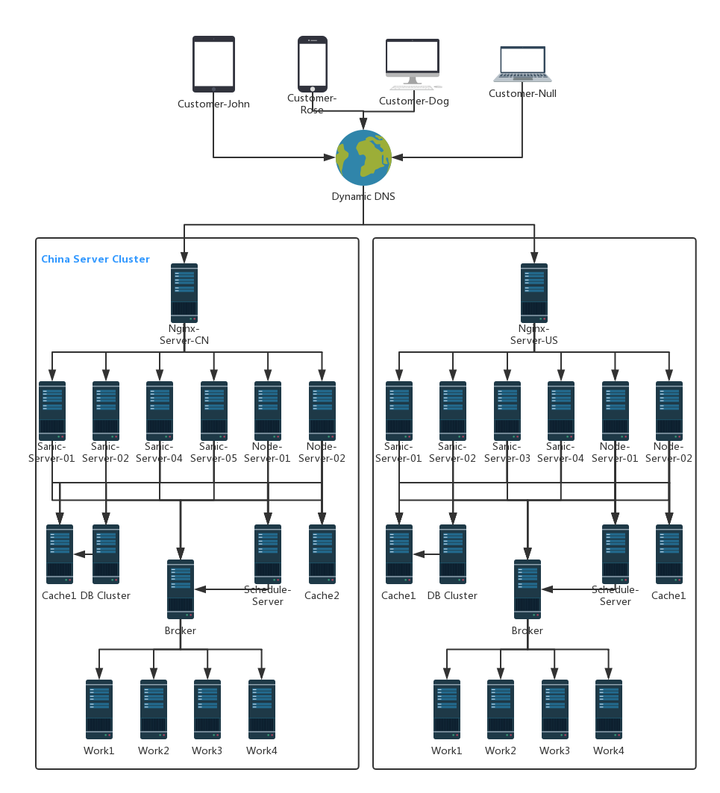

#### 与后端数据交互设计

##### 1. 总体架构

```
1. 位于不同位置的用户通过Dynamic DNS获取到最优的服务器地址
2. 用户发送访问请求到最优Nginx服务器
3. Nginx服务器访问后台Node服务器请求前端资源发送给用户
4. 前端通过HTTP/JSON与Nginx服务器交互，Nginx将均衡请求到后端Sanic服务器
5. 如果发起异步任务或者Schedule Server激活定时任务，Work集群将会被激活
6. 在机器空闲或者遇到前端操作需要预判断用户操作时候，Work将启动缓存任务并将结果存入缓存

```